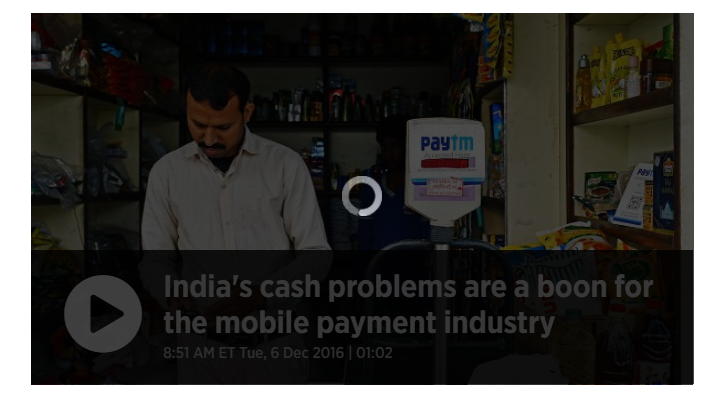

# cs891-f17
Class page for ODU CS 791 / 891 Web Archiving Seminar

https://archive-it.org/collections/9541

https://webrecorder.io/kathi_gkr/demonetisation-in-india
 
 Link to the seeds: https://github.com/GirishKathireddy/cs891-f17/blob/master/week6/index.html

## Experience with tools
## WebRecorderIO
 
* Able to capture videos as estimated
* Best part is we can capture the events we want to focus on particularly by navigating to the specific links.
* Through web recorder one disadvantage is that one has to remember the events he saved if he wants to access the embedded link once again   which can cause problem in long term when the person want to navigate from within the page.
* Providing information which says that the document has been saved would be useful when the user clicks on the link he scrolled already.
* Was not able to capture the video through Web Recorder https://webrecorder.io/kathi_gkr/demonetisation-in-india/20171008200902/https://www.cnbc.com/2016/12/04/demonetization-news-modis-cash-curbs-in-india-spark-long-lines.html

## Archive-It

* It is easy to add seeds in the Archive-It and start the crawl. From the user perspective it has simple interface.
* When the crawl finishes, the seeds shows the link to the wayback machine, but we cannot access the resource in the next 24 hours. I feels it is better not to show the link till the resource is accessible.
* I was not able to access this link, later I realised it is because of robots.txt file.  http://wayback.archive-it.org/9541/20171008230305/http://www.thehindu.com/todays-paper/tp-national/tp-karnataka/Petty-fights-long-queues-at-petrol-outlets-mark-day-after-demonetisation-of-notes/article16276487.ece   

## WarCreate

* Idea of extension is intresting, but the tool can capture only the static pages but not the embedded links on one click. The tool can have great future if the user can do multiple things like browsing through links and recording videos.
* I feel the user will not be sure of what is going on when he clicks the extension. He is not sure if he needs to wait or if there is some problem with the extension until the file downloads. 

## Wail 

* The tool works great.
* One observation is that I feel that the tool is good for research perspective but not from the side of the customer/user since when the user clicks on the Wail tool apart from the browser it pops-up two terminal screens which may make the user feel uncomfortable or annoyed.  

## Reflection
* I feel 15 seeds would accurately characterize the topic, given if the user is able to identify the seeds appropriately. At the same time if user want to capture timely sequences the number of seeds would increase simultaneoulsy. 
* In the future  my collection could be used to understand the immediate effect of immense changes like demonetization. One could understand the chaos created and can make sure such things will not be repeated again.
*  I haven't observed any changes in the resources except one in web recorder. I was not able to play the video which I recorded last time. 
https://webrecorder.io/kathi_gkr/demonetisation-in-india/20171008191309/https://blogs.wsj.com/indiarealtime/2016/11/08/full-text-of-indian-prime-minister-narendra-modis-speech-on-replacing-largest-rupee-notes/

